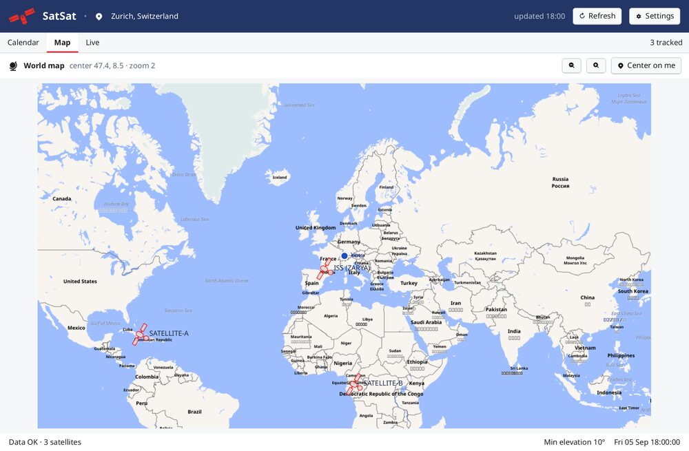
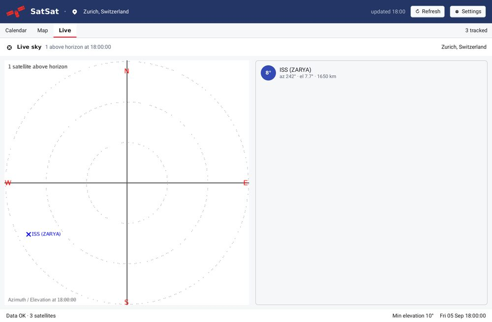
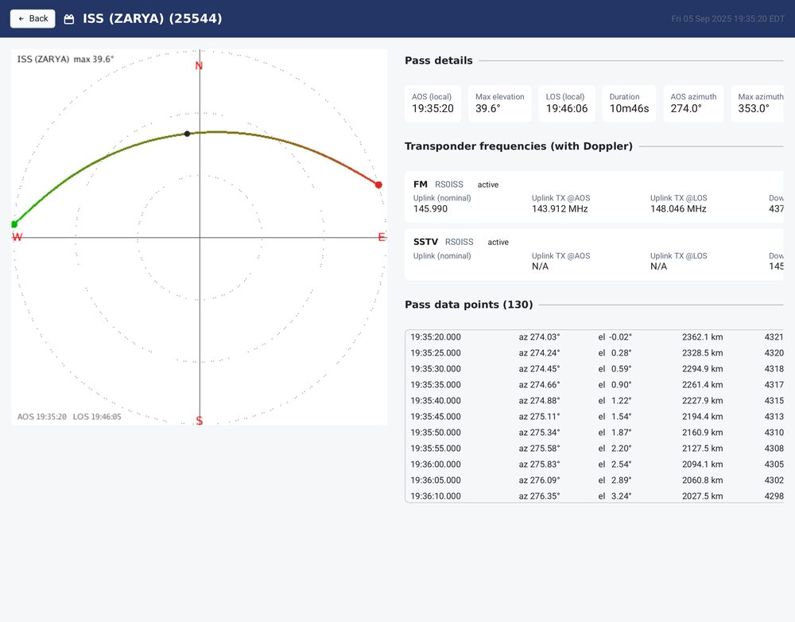
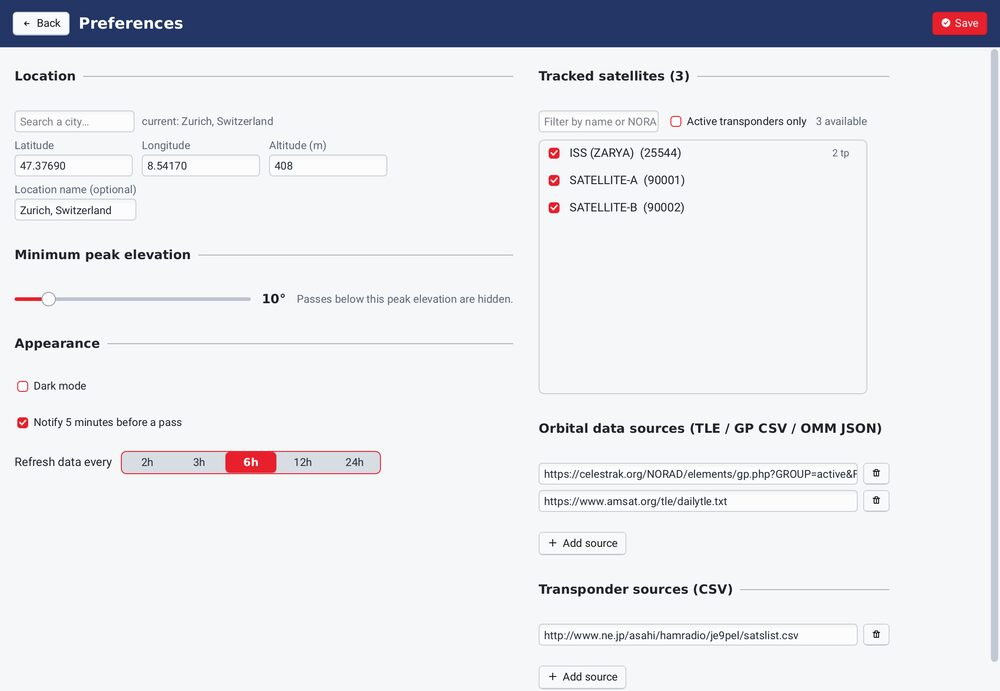

# SatSat

SatSat is a native satellite pass tracker for the desktop, written in Go with
[Shirei](https://go.hasen.dev/shirei). It is the successor to the **SatSat**
iOS app — long removed from the App Store and preserved at
[satsat.inair.space](https://satsat.inair.space/) — and the desktop companion to
the [websat](https://websat.inair.space) web tracker (module `gosatsat`).
Predict the upcoming passes of the satellites you follow, watch your sky live,
follow them on a world map, and inspect any pass in detail.

SatSat is aimed primarily at **radio amateurs**: beyond the polar sky view and
the pass calendar, it lists each satellite's transponders (uplink, downlink,
beacon, mode, callsign) and shows the **Doppler-shifted frequencies at AOS and
LOS**, plus the pre-corrected uplink transmit frequency, so you know exactly
where to tune before a pass.

Orbit propagation uses [`github.com/akhenakh/sgp4`](https://github.com/akhenakh/sgp4);
the map is rendered with
[`github.com/akhenakh/maprender`](https://github.com/akhenakh/maprender).

The look and feel revives the original iOS app: navy chrome, red accents,
white panels, a dashed-crosshair polar sky with red cardinals, a green-to-red
pass path, and blue live-satellite markers. The original icon and satellite
artwork ship in `Resources/`.

## Screenshots

<p align="center">
  
</p>
<p align="center">
  
  
</p>
<p align="center">
  
</p>

## Install

On macOS, with [Homebrew](https://brew.sh) (cask from
[akhenakh/homebrew-tap](https://github.com/akhenakh/homebrew-tap)) — this
installs **`SatSat.app`** into `/Applications`:

```sh
brew install --cask akhenakh/tap/satsat
```

Or from source (requires Go):

```sh
go install github.com/akhenakh/gosatsat@latest
```

Prebuilt archives for Linux, macOS, and Windows (amd64/arm64) are attached to
each [release](https://github.com/akhenakh/gosatsat/releases). On Linux and
Windows the archive contains the `satsat` binary next to its `Resources/`
directory, which must stay together.

On macOS the archive contains only **`SatSat.app`** — drag it into
`/Applications`. The bundle is unsigned, so the first launch needs
right-click → Open (or `xattr -dr com.apple.quarantine SatSat.app`).

## Features

- **Passes** — sortable list of the next 72 hours of passes for your tracked
  satellites, with a live countdown and a "next pass" card. Click a pass for
  the full detail view.
- **Map** — world map (Mapbox GL style via `maprender`) with the current
  sub-satellite point of every tracked satellite and your own location. The
  base map is rendered once and cached; only the satellite markers move.
  Falls back to a graticule if tiles are unavailable.
- **Sky** — live polar radar of your sky, refreshed about once per second, with
  every tracked satellite above the horizon.
- **Pass detail** — polar pass plot, AOS/LOS/max-elevation facts, transponder
  frequencies at AOS/LOS with Doppler correction (uplink pre-corrected), and
  the sampled look-angle table.
- **Preferences** — location (city list or lat/lng), tracked satellites,
  minimum peak elevation, refresh interval, TLE source URLs, transponder source
  URLs, dark mode, and pass notifications.
- **Pass notifications** — an operating-system notification 5 minutes before a
  tracked pass starts (Linux via `notify-send`/libnotify, macOS via
  `osascript`, Windows via a PowerShell notification). Toggle it in
  Preferences.

The layout is responsive: pass detail switches between side-by-side and stacked,
Preferences uses one or two columns, the Live plot scales with the window, and
the map fills the available width.
- **Multiple data sources**, merged; each source's failures are reported without
  discarding the others. CelesTrak's GP **CSV (OMM)** and **OMM JSON** formats
  are supported (as is plain TLE text from AMSAT), so catalog numbers above
  99999 work.
- **First-run onboarding** — pick a location and satellites; everything is
  saved to a JSON config under the XDG user config directory
  (`~/.config/gosatsat/config.json` on Linux).
- **Offline-friendly start** — the last successful TLE/transponder download is
  cached next to the config (`tle-cache.json`) and loaded at startup, so the
  app is usable immediately while a fresh download runs in the background.

## Data sources and CelesTrak policy

Orbital elements come from the URLs in the config. The default set is:

- CelesTrak GP **CSV** (`gp.php?...FORMAT=csv`), which uses the OMM fields and
  supports catalog numbers above 99999; **OMM JSON** (`FORMAT=json`) is also
  understood.
- AMSAT daily TLE (`https://www.amsat.org/tle/dailytle.txt`), plain TLE text.

The format is detected from the response, so any of the three can be added.
CSV and JSON are parsed by the `sgp4` library (`ParseOMMsCSV` / `ParseOMMs`),
which builds element sets directly from the numeric catalog id.

To respect CelesTrak's [usage policy](https://celestrak.org/usage-policy.php),
SatSat keeps at least **2 hours** between requests: it loads the cached elements
instead of refetching when they are fresh, refuses a manual refresh inside the
2-hour window (showing a status-bar notice), and the refresh-interval choices
start at 2 h. Old CelesTrak `FORMAT=tle` URLs in an existing config are
migrated to `FORMAT=csv` automatically.

## Build and run

```sh
go run .
go run . --dark
```

### Offline demo

`--demo` loads deterministic orbital data so the app is fully populated
without a network connection — handy for screenshots and for trying the UI:

```sh
go run . --demo
go run . --demo --tab sky
go run . --demo --detail
go run . --demo --view prefs
go run . --demo --view onboarding --step 1
```

### Headless snapshots

Any screen can be rendered headlessly to a PNG (no window or GPU needed):

```sh
go run . --demo --png /tmp/main.png
go run . --demo --detail --png /tmp/detail.png
go run . --demo --tab map --png /tmp/map.png
go run . --demo --tab sky --png /tmp/sky.png
```

## Tests

```sh
go test ./...
go vet ./...
```
